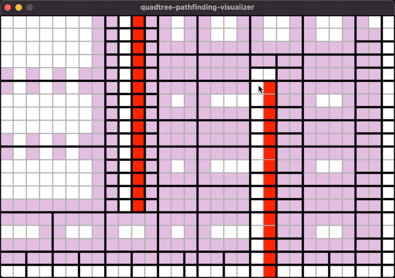
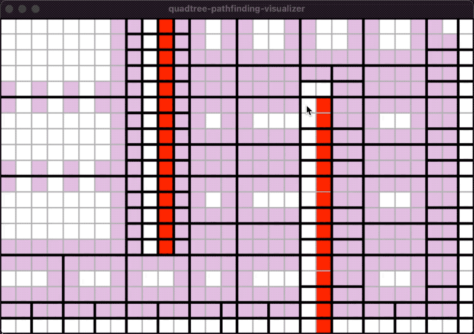
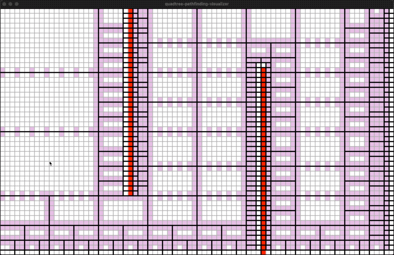
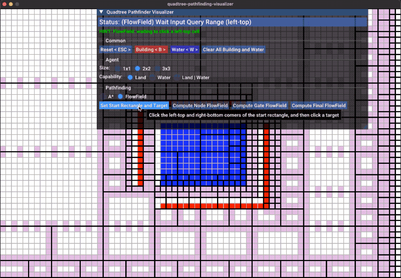

quadtree-pathfinding
====================

May unstable before version 1.0.0! Still in dev!

Hierarchical path finding on quadtree for equal-weighted 2D grid map.

Idea
----

In a rectangle with no obstacles inside, the shortest distance between two cells is a straight line.
So we can use a quadtree to split the map into two kind of regions: completely obstacles and completely empty areas,
and then build a graph on top to perform A* search.

Demo
----

Colors:

* White: Land.
* Red: Walls (buildings).
* Blue: Water
* Green: Agent and Path.
* Purple: Gate cells
* Yellow: Quadtree nodes on path.

| <!-- -->                                                          |  <!-- -->                                                                         |
| ------------------------------------------------------------------| ------------------------------------------------------------------|
| agent-size=2, capability= Land   |  agent-size=2, capability= Land \| Water                   |
| agent-size=2, lager map     | agent-size=2, flowfield   |


Concepts and Mechanisms
------------------------

1. A QuadtreeMap is a 2D grid map maintained by a quadtree.
2. The quadtree splits the grid map into multiple sections.
3. A section on a quadtree map contains no obstacles or all obstacles.
4. The shortest path inside a section without obstacles will be a straight line.
5. Adjacent quadtree nodes are connected by multiple gates.
6. A gate is composed of two adjacent cells, one on each side, directed.
7. All nodes compose the 1st level abstract graph.
8. All gates compose the 2nd level abstract graph.
9. Path finding performs on the 2 or 3 levels graphs:
   1. Find the node path on the 1st level graph (it's optional, faster but less optimal).
   2. Find the gate path on the 2nd level graph.
   3. Fill the straight lines between gate cells.
10. A QuadtreeMapX is a manager of multiple quadtree maps for different agent sizes and terrain
    types supports.
11. A PathFinder always works on a single QuadtreeMap the same time. A pathfinding request is
    reduced into a progress without the agent-size and terrain factors.

Code Example
------------

- [A* PathFinder](examples/astar)
- [FlowField PathFinder](examples/flowfield)

Source Files
------------

To use it, copy away these files:

```bash
Source/*.h
Source/*.cpp
Source/Internal/*.h
Source/Internal/*.cpp
Source/3rdParty/*
```

API list can be found at [qdpf.hpp](qdpf.hpp).

Visualizer
----------

Install conan, and build:

```bash
make -C Visualizer
```

Run the Visualizer:

```bash
./Visualizer/Build/QuadtreePathfindingVisualizer -w 100 -h 60 -step 1
```

Problems Unsolved (Plan)
------------------------

1. Dynamical weighted A*.


License
-------

BSD.
