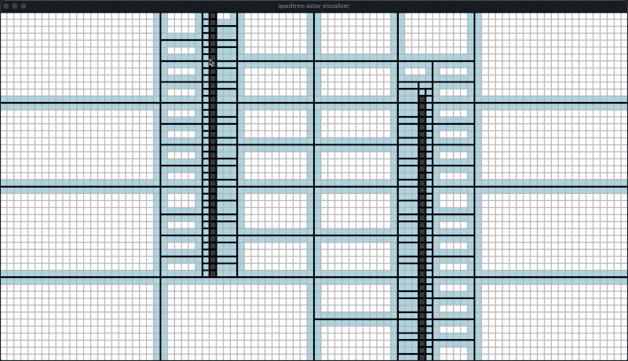
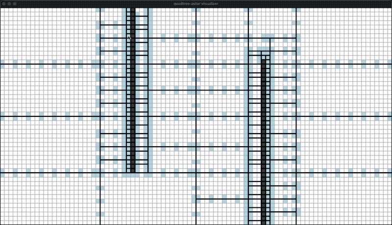

quadtree-astar
==============

May unstable before version 1.0.0!

Hierarchical path finding on quadtree for equal-weighted 2D grid map.

Idea
----

In a rectangle with no obstacles inside, the shortest distance between two cells is a straight line.
So we can use a quadtree to split the map into two kind of regions: completely obstacles and completely empty areas,
and then build a graph on top to perform A* search.

Demo
----

| <!-- -->                                                          |
| ------------------------------------------------------------------|
| gate step=1                   |
| gate step=3                   |
| gate step=1 use node path     |


Concepts and Mechanisms
------------------------

1. A QuadtreeMap is a 2D grid map maintained by a quadtree.
2. The quadtree splits the grid map into multiple sections.
3. A section contains no obstacles or all obstacles.
4. The shortest path inside a section without obstacles will be a straight line.
5. Adjacent quadtree nodes are connected by multiple gates.
6. A gate is composed of two adjacent cells, one on each side, directed.
7. All nodes compose the 1st level abstract graph.
8. All gates compose the 2nd level abstract graph.
9. Path finding performs on the 2 or 3 levels graphs:
   1. Find the node path on the 1st level graph (it's optional, faster but less optimal).
   2. Find the gate path on the 2nd level graph.
   3. Fill the straight lines between gate cells.

Code Example
------------

Checks [simple-example](simple-example/main.cpp).

Visualizer
----------

Install SDL and build:

```bash
make -C visualizer install
make -C visualizer cmake
make -C visualizer build
```

Run the visualizer:

```bash
./visualizer/build/quadtree-astar-visualizer -w 40 -h 30 -s 1
```

Operations:

1. Click the left mouse button to add or remove obstacles, drag the left-mouse for batch.
2. Click the right mouse button to set start and target cells.
   Right click again to show the routes, and again to show the path.

Problems Unsolved (Plan)
------------------------

1. Dynamical weighted A*.
2. How to implement flow-field pathfinding on quadtree?


License
-------

BSD.
