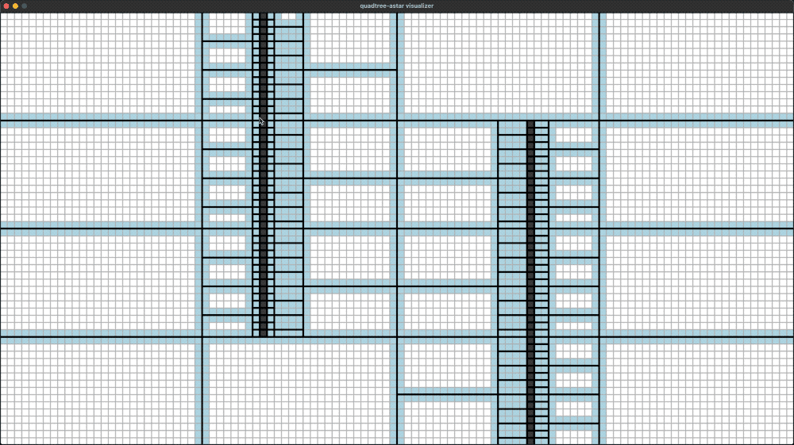
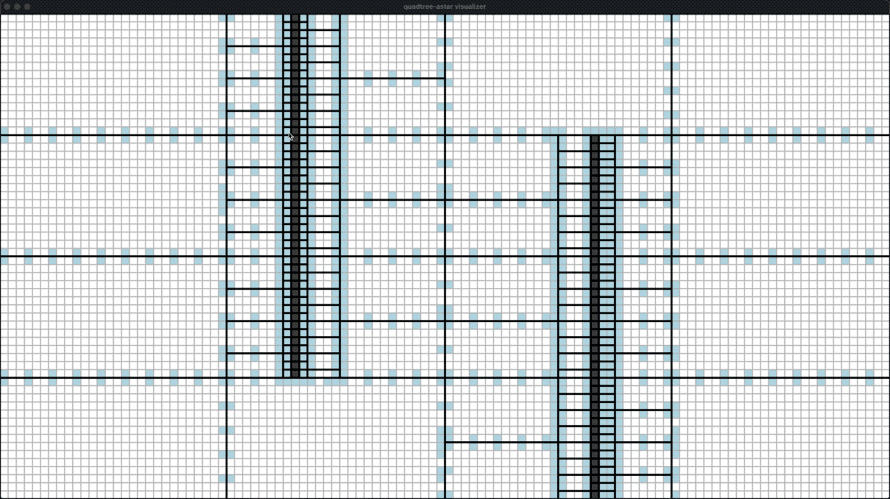

quadtree-astar
==============

May unstable before version 1.0.0!

Hierarchical path finding on quadtree for equal-weighted 2D grid map.

Idea
----

In a rectangle with no obstacles inside, the shortest distance between two cells is a straight line.
So we can use a quadtree to split the map into two kind of regions: completely obstacles and completely empty areas,
and then build a graph on top to perform A* search.

Demo
----

| <!-- -->                                           |
| -------------------------------------------------- |
| gate step=1     |
| gate step=3     |


Concepts and Mechanisms
------------------------

1. A QuadtreeMap is a 2D grid map dynamatically maintained by a quadtree.
2. The quadtree splits the grid map into multiple sections.
3. A section contains no obstacles or all obstacles.
4. In a section without any obstacles, the shortest path inside it will be a straight line.
5. There are multiple connections between adjacent quadtree nodes (aka sections).
6. And a connection is composed of two adjacent gate cells, one on each side.
7. All gates compose an abstract graph, and the path finder works on it.
8. We first find the route cells (start, gates and target), and the fill the straight lines
   between them.

Code Example
------------

Checks [simple-example](simple-example/main.cpp).

Visualizer
----------

Install SDL and build:

```bash
make -C visualizer install
make -C visualizer cmake
make -C visualizer build
```

Run the visualizer:

```bash
./visualizer/build/quadtree-astar-visualizer -w 40 -h 30 -s 1
```

Operations:

1. Click the left mouse button to add or remove obstacles, drag the left-mouse for batch.
2. Click the right mouse button to set start and target cells.
   Right click again to show the routes, and again to show the path.

Problems Unsolved (Plan)
------------------------

1. Dynamical weighted A*.
2. How to implement flow-field pathfinding on quadtree?


License
-------

BSD.
